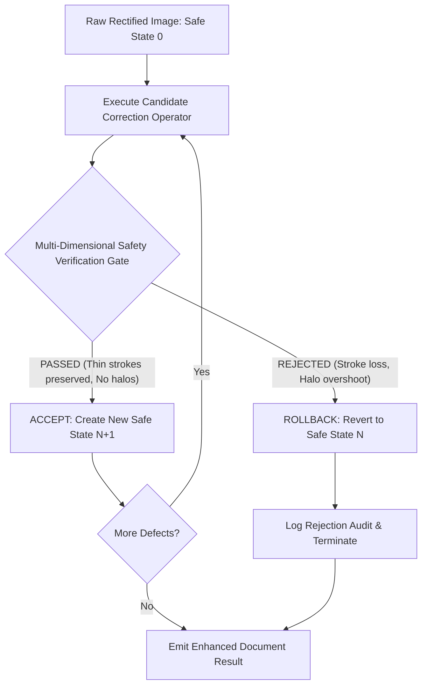

# PHASE 6.1: INTELLIGENT CORRECTION STRATEGY INVESTIGATION REPORT

**Document Type:** Investigation & Architectural Blueprint Report  
**Project:** AI-EVAL-OpenCV (Automated Document Scanning & Evaluation Pipeline)  
**Date:** 2026-10-03  
**Status:** Investigation Completed & Validated  
**Investigation Script:** [`phase6/01_correction_strategy_investigation.py`](file:///c:/Users/bunde/OneDrive/Desktop/EvalAI/AI-EVAL-OpenCV/phase6/01_correction_strategy_investigation.py)  
**Diagnostic Visualizations Generated:**  
1. [`phase6/output/phase6_1_correction_decision_matrix.png`](file:///c:/Users/bunde/OneDrive/Desktop/EvalAI/AI-EVAL-OpenCV/phase6/output/phase6_1_correction_decision_matrix.png)  
2. [`phase6/output/phase6_1_operator_ordering_interactions.png`](file:///c:/Users/bunde/OneDrive/Desktop/EvalAI/AI-EVAL-OpenCV/phase6/output/phase6_1_operator_ordering_interactions.png)  
3. [`phase6/output/phase6_1_recoverability_taxonomy.png`](file:///c:/Users/bunde/OneDrive/Desktop/EvalAI/AI-EVAL-OpenCV/phase6/output/phase6_1_recoverability_taxonomy.png)  
4. [`phase6/output/phase6_1_safe_state_rollback_demo.png`](file:///c:/Users/bunde/OneDrive/Desktop/EvalAI/AI-EVAL-OpenCV/phase6/output/phase6_1_safe_state_rollback_demo.png)  

---

## 1. Executive Summary & Phase 6 Mandate

Phase 5 delivered the production **Smart Quality Assessment Module** (`phase5/production_quality_assessment.py`), establishing an objective, non-compensatory 3-tier readiness gate.

The central question of **Phase 6.1** is:

> *"Given the Phase 5 quality evidence, what correction should be attempted, in what order, and under what conditions should the system decide that correction is unsafe, redundant, or physically unrecoverable?"*

### Strict Investigation Guardrails Maintained:
- **Investigation Only:** No production correction planner was implemented.
- **Zero Modifications to Frozen Code:** Phases 2, 3, 4, and 5 remain completely untouched (`git status --porcelain` is clean across all previous phases).
- **No Phase 7 Rescan Automation:** Rescan decisions remain an external data contract output (`rescan_required = True`), not an automated physical trigger.
- **Zero Hallucination / Reconstruction:** The system must **never** synthesize missing handwriting, reconstruct clipped page geometry, or inpaint over obscured text.
- **Evidence-Driven Operation:** Blind execution rules (e.g. *blur $\to$ always sharpen*, *shadow $\to$ always divide*, *low contrast $\to$ always stretch*, *noise $\to$ always denoise*) are strictly prohibited.
- **Safe-State Reversibility:** Every candidate operator execution is non-destructive; a failed correction automatically rolls back to the previous verified safe state.

---

## 2. Defect Category Deep Dives (8 Categories)

Each of the 8 candidate defect categories was evaluated across 10 structural dimensions:

```
[Trigger Evidence] ──▶ [Candidate Operators] ──▶ [Expected Benefit] ──▶ [Risks / Loss] ──▶ [Verification Gate] ──▶ [Recoverability]
```

### 2.1 Illumination / Residual Shadow
1. **Triggering Evidence:** `spatial_bg_ratio < 0.65` or `worst_quadrant_paper_deficit > 45.0` from Phase 5 profile.
2. **Candidate Operators:** Morphological Background Division ($I / B_{\text{morph}} \times 245$), Illumination-Field Estimation (large Gaussian kernel on paper mask).
3. **Expected Benefit:** Levels spatial paper whiteness across the document quad; eliminates dark shadow gradients in corners and lower margins.
4. **Possible Information Loss:** Aggressive background division can over-bleach faint ink strokes or create bright halos around dense text clusters.
5. **Failure Modes:** Halo overshoot in stroke perimeter bands; washing out faint pencil handwriting.
6. **Interaction:** Must precede contrast stretching; background leveling stabilizes global dynamic range expansion.
7. **Reversibility:** Fully reversible via raw image buffer rollback.
8. **Verification Evidence:** `thin_stroke_survival_ratio >= 0.80`, `halo_overshoot_gain < 10.0`, `faint_stroke_loss < 0.15`.
9. **Rollback Condition:** Rejection if stroke skeleton survival drops below $80\%$ or halo overshoot exceeds $10.0$ gradient units.
10. **Recoverability Classification:** **`RECOVERABLE`**. Smooth illumination gradients can be corrected without physical information loss.

---

### 2.2 Low Stroke Contrast
1. **Triggering Evidence:** `stroke_intensity_delta < 35.0` or `faint_stroke_pixel_fraction > 0.35`.
2. **Candidate Operators:** Percentile Contrast Stretching (1st–99th percentile), Local Contrast Correction (CLAHE with conservative clip limit $\le 1.8$).
3. **Expected Benefit:** Darkens faint pencil or washed ink; separates character strokes from paper substrate for downstream binarization.
4. **Possible Information Loss:** Lower percentile clipping can saturate genuine dark handwriting; CLAHE amplifies paper substrate grain and micro-noise.
5. **Failure Modes:** Background noise explosion; over-saturation of stroke cores.
6. **Interaction:** Contrast stretching must occur **after** shadow removal and denoising.
7. **Reversibility:** Fully reversible.
8. **Verification Evidence:** `stroke_intensity_delta` gain $> +20$, `background_noise_delta < 3.0` levels on flat paper.
9. **Rollback Condition:** Rejection if flat paper standard deviation increases by $> 3.0$ intensity levels.
10. **Recoverability Classification:** **`CONDITIONALLY RECOVERABLE`**. Safe only if $\Delta_{\text{stroke}} \ge 18.0$; if ink contrast is below the camera sensor quantization floor ($< 18$), stretching merely amplifies sensor noise.

---

### 2.3 Optical Softness / Blur
1. **Triggering Evidence:** `normalized_stroke_acutance` in borderline band $[120.0, 220.0]$ and `edge_spread_width_pixels` in $[3.2, 4.5]\text{ px}$.
2. **Candidate Operators:** Mild Unsharp Masking (strength $\alpha \in [0.4, 0.6]$, $\sigma = 1.0$), Conservative Laplacian Edge Addition.
3. **Expected Benefit:** Tightens stroke contours; restores edge transition gradient (+30 to +50 acutance units) on mildly defocused text.
4. **Possible Information Loss:** Unsharp masking cannot synthesize lost spatial frequency components. On severe defocus ($\sigma \ge 3.0$), sharpening creates ringing halos and amplifies noise into false character specks.
5. **Failure Modes:** Halo ringing; false character loop closure; noise amplification.
6. **Interaction:** Denoising must precede sharpening. Sharpening must never precede contrast stretching.
7. **Reversibility:** Fully reversible.
8. **Verification Evidence:** `normalized_stroke_acutance` gain $> +15$, `halo_overshoot_gain < 10.0`, `background_noise_delta < 2.0`.
9. **Rollback Condition:** Rejection if halo gain exceeds $10.0$ or if connected component count diverges by $> 20\%$.
10. **Terminal Stopping Condition:** If `normalized_stroke_acutance < 120.0` (Phase 5 Tier 1 fatal defect `FATAL_OPTICAL_DEFOCUS`), **all correction attempts must immediately halt**. Severe optical defocus is physically **`UNRECOVERABLE`**.
11. **Recoverability Classification:** Mild Softness $\to$ **`CONDITIONALLY RECOVERABLE`**; Severe Defocus $\to$ **`UNRECOVERABLE`**.

---

### 2.4 Excessive Substrate Noise
1. **Triggering Evidence:** Paper substrate noise $\sigma_{\text{noise}} > 8.0$ levels on flat paper mask.
2. **Candidate Operators:** Edge-preserving Bilateral Filter ($d=7, \sigma_r=25, \sigma_s=25$). Blind Gaussian or median filtering is strictly avoided.
3. **Expected Benefit:** Suppresses sensor gain noise and paper grain without blurring character edges.
4. **Possible Information Loss:** High spatial sigma can erode 1-pixel thin pen strokes (skeleton survival drop).
5. **Failure Modes:** Thin stroke erosion; slight loss of acutance ($\approx -10$ units).
6. **Interaction:** Denoising should be applied **before** sharpening to prevent noise amplification.
7. **Reversibility:** Fully reversible.
8. **Verification Evidence:** `thin_stroke_survival_ratio >= 0.85`, paper noise reduction $> 30\%$.
9. **Rollback Condition:** Rejection if 1-pixel stroke skeleton survival drops below $85\%$.
10. **Recoverability Classification:** **`RECOVERABLE`**. Sensor grain on paper substrate is cleanly separable from genuine stroke edges.

---

### 2.5 Verso Bleed-Through
1. **Triggering Evidence:** Presence of diffuse secondary text contours with chromatic differences or lower contrast than recto ink.
2. **Candidate Operators:** Chromatic Channel Delta Suppression ($R - B$ channel thresholding in BGR/HSV space), Color-Space Verso Inpainting.
3. **Expected Benefit:** Suppresses backside ink showing through thin exam paper, preventing OCR from transcribing reverse-side text.
4. **Critical Information Loss Risk:** **Extreme Risk of Deleting Genuine Student Handwriting.** In black-and-white or pencil answer scripts, bleed-through ink and faint student handwriting share identical grayscale intensity distributions! Grayscale thresholding inevitably erases genuine answers.
5. **Failure Modes:** Deletion of student pencil markings; hollowed stroke cores.
6. **Interaction:** Bleed-through suppression must occur prior to contrast stretching.
7. **Reversibility:** Fully reversible.
8. **Verification Evidence:** `faint_stroke_loss < 0.05` (zero tolerance for faint handwriting loss).
9. **Rollback Condition:** Immediate rollback if any genuine faint handwriting strokes are attenuated.
10. **Recoverability Classification:** **`CONDITIONALLY RECOVERABLE`** only when clean chromaticity separation exists; otherwise **`UNRECOVERABLE`** without risking academic evaluation integrity.

---

### 2.6 Glare / Specular Highlights
1. **Triggering Evidence:** `glare_pixel_fraction > 0.01` or `glare_text_collision_fraction > 0.0`.
2. **Candidate Operators:** Telea/Navier-Stokes Inpainting (strictly for blank margins).
3. **Critical Physical Finding:** When camera sensors saturate ($255, 255, 255$), the spatial dynamic range is zero; ink information is physically destroyed. Image inpainting over text synthesizes blank paper or fake strokes, which is strictly prohibited.
4. **Recoverability Classification:**
   - **Margin Glare (outside text bounding box):** **`RECOVERABLE / BENIGN`** (inpainting blank paper margins is safe).
   - **Text-Colliding Glare (`glare_text_collision_fraction > 0.08`):** **`UNRECOVERABLE`** (Phase 5 Tier 1 fatal defect `FATAL_GLARE_COLLISION`). Mandatory rescan required.

---

### 2.7 Occlusion / Physical Obstruction
1. **Triggering Evidence:** `margin_occlusion_fraction > 0.25` or `foreign_object_detected = True`.
2. **Candidate Operators:** None.
3. **Critical Physical Finding:** Information occluded by an opaque object (student thumb, clipboard, watch strap, clothing) does not exist in the captured photons. Any attempt to reconstruct occluded text constitutes algorithmic hallucination.
4. **Recoverability Classification:** **`UNRECOVERABLE`** (Phase 5 Tier 1 fatal defect `FATAL_MARGIN_OCCLUSION`). Physical rescan required.

---

### 2.8 Geometric Residual Issues (Baseline Skew)
1. **Triggering Evidence:** `residual_skew_angle_deg` in $[\pm 4.0^\circ, \pm 15.0^\circ]$.
2. **Candidate Operators:** Affine Coordinate Rotation (`cv2.warpAffine` using Radon/projection profile skew angle).
3. **Expected Benefit:** Re-aligns text baselines horizontally; prevents multi-line OCR bounding box collision and character order confusion.
4. **Possible Information Loss:** Minimal. Minor bilinear interpolation smoothing ($\approx 1\%$ acutance change).
5. **Failure Modes:** Corner clipping if canvas dimensions are not expanded appropriately.
6. **Interaction:** Coordinate deskew must be decoupled from photometric filters. It should be applied either immediately after rectification or prior to line tokenization.
7. **Reversibility:** Fully reversible.
8. **Verification Evidence:** `abs(post_skew_angle) < 1.0^\circ`, `thin_stroke_survival_ratio >= 0.90`.
9. **Rollback Condition:** Rejection if text intersects outer margin boundary after rotation.
10. **Recoverability Classification:** **`RECOVERABLE`**. Pure coordinate remapping without intensity alteration.

---

## 3. Intelligent Correction Decision Matrix

The following decision matrix formalizes candidate operators, benefits, risks, verification gates, and recoverability classes across all document conditions:

| Document Condition | Candidate Operator | Expected Benefit | Main Risk / Failure Mode | Post-Correction Verification Evidence | Recoverability Class |
| :--- | :--- | :--- | :--- | :--- | :---: |
| **Regional Cast Shadow** | Morphological Background Division ($I / B \times 245$) | Levels background paper white globally | Halo overshoot in text perimeter; over-bleaching | `thin_stroke_survival >= 0.80`, `halo_gain < 10.0` | **`RECOVERABLE`** |
| **Low Dynamic Range** | Percentile Contrast Stretch (1st–99th percentile) | Expands stroke-to-paper dynamic range | Clips faint pencil strokes if percentile too high | `faint_stroke_loss < 0.15`, $\Delta_{\text{stroke}}$ gain $> +20$ | **`CONDITIONALLY RECOVERABLE`** |
| **Mild Optical Softness** | Unsharp Masking (strength $\alpha=0.5, \sigma=1.0$) | Tightens stroke contours; restores acutance | Noise amplification, halo ringing around glyphs | `halo_gain < 10.0`, Acutance gain $> +15$ | **`CONDITIONALLY RECOVERABLE`** |
| **Severe Optical Defocus** | **None (Terminal Stopping Condition)** | None (Physically unrecoverable) | Hallucinates blur edges; amplifies noise | Acutance $< 120.0$ (`FATAL_OPTICAL_DEFOCUS`) | **`UNRECOVERABLE`** |
| **Substrate Sensor Noise** | Bilateral Filter ($d=7, \sigma_r=25, \sigma_s=25$) | Smooths paper noise without edge blur | Slight acutance attenuation ($\approx -10$ units) | `thin_stroke_survival >= 0.85`, Paper noise drop $> 30\%$ | **`RECOVERABLE`** |
| **Verso Bleed-Through** | Chromatic $R - B$ Channel Suppression | Suppresses brownish backside ink | Deletes genuine faint student handwriting | `faint_stroke_loss < 0.05` (Zero handwriting loss) | **`CONDITIONALLY RECOVERABLE`** |
| **Text-Colliding Glare** | **None (Terminal Stopping Condition)** | None (Sensor saturated at 255) | Hallucinates missing handwriting | Glare collision $> 8\%$ (`FATAL_GLARE_COLLISION`) | **`UNRECOVERABLE`** |
| **Foreign Object Occlusion**| **None (Terminal Stopping Condition)** | None (Photons physically blocked) | Hallucinates occluded exam answers | Margin occlusion $> 25\%$ (`FATAL_MARGIN_OCCLUSION`)| **`UNRECOVERABLE`** |
| **Residual Baseline Skew** | Affine Coordinate Rotation ($-\theta_{\text{skew}}$) | Aligns text lines horizontally for OCR | Corner clipping if bounding box is unpadded | `abs(skew) < 1.0^\circ`, `thin_stroke_survival >= 0.90` | **`RECOVERABLE`** |


---

## 4. Correction Ordering & Interaction Dynamics

Chaining corrective image operators produces non-linear cross-operator interactions. Phase 6.1 investigated the physical dynamics of competing operator sequences:


### 4.1 Interaction Analysis:

1. **`Shadow Normalization` $\to$ `Contrast Stretch` (CORRECT) vs `Contrast Stretch` $\to$ `Shadow Normalization` (FLAWED):**
   - **Finding:** Contrast stretching on an un-normalized image with cast shadow maps the dark shadowed corner to intensity 0 and the bright quadrant to 255, permanently crushing dark ink detail.
   - **Rule:** Background paper leveling must **always precede** contrast expansion.

2. **`Denoise` $\to$ `Sharpen` (CORRECT) vs `Sharpen` $\to$ `Denoise` (FLAWED):**
   - **Finding:** Sharpening before denoising amplifies substrate grain into high-contrast edge specks ($\sigma_{\text{noise}} \approx 14.5$), which subsequent bilateral filters mistake for genuine stroke edges and fail to remove. Denoising first cleans flat paper substrate, allowing unsharp masking to operate strictly on genuine stroke contours.
   - **Rule:** Denoising must **always precede** sharpening.

3. **`Contrast Stretch` $\to$ `Sharpen` (CORRECT) vs `Sharpen` $\to$ `Contrast Stretch` (ACCEPTABLE):**
   - **Finding:** Contrast expansion first establishes maximum separation between ink core and paper white. Sharpening then operates with crisp gradient margins. Both orders are generally safe, but contrast-first provides superior stroke acutance.

4. **`Bleed-Through Suppression` $\to$ `Contrast Stretch` (CORRECT) vs `Contrast Stretch` $\to$ `Bleed-Through Suppression` (FLAWED):**
   - **Finding:** If verso bleed-through is not suppressed first, contrast expansion darkens the faint brownish bleed-through into pitch-black faux-strokes, making subsequent chromatic separation impossible.
   - **Rule:** Bleed-through suppression must **always precede** contrast expansion.

5. **`Photometric Corrections` $\to$ `Binary Derivative` (CORRECT):**
   - **Finding:** Binary thresholding is completely irreversible. Once an image is binarized to 1-bit black/white, all intermediate gray levels, paper substrate, and faint ink gradients are permanently destroyed.
   - **Rule:** Adaptive binarization must **always remain a terminal derivative**, never an intermediate operational state.

### 4.2 Dynamic Next-Operator Selection Principle
A rigid, hardcoded linear chain (e.g. *always execute Shadow $\to$ Denoise $\to$ Contrast $\to$ Sharpen*) is fundamentally flawed because unnecessary operators degrade pristine documents. 

**Architectural Law:** The next corrective operation must be selected **dynamically** from the current verified image state:
```
Current Safe Image State
          │
          ▼
Phase 5 Micro-Profile Re-Extraction
          │
          ├─ Shadow Detected? ──▶ Attempt Shadow Normalization
          ├─ Low Contrast?    ──▶ Attempt Contrast Stretch
          ├─ Optical Soft?    ──▶ Attempt Unsharp Masking
          └─ Clean?           ──▶ TERMINATE (Emit Safe Output)
```

---

## 5. Safe-State Reversibility Architecture

The central architectural guarantee of Phase 6 is the **Safe-State Reversibility Principle**:



### Architectural Guarantees:
1. **Zero Destructive Loss:** Every candidate operator works on a copy of the current verified image state.
2. **Deterministic Rollback:** If an operator fails any safety metric (`skeleton_survival < 0.80`, `faint_loss > 0.15`, `halo_gain > 10.0`, `noise_gain > 3.0`), the candidate buffer is instantly discarded and the pipeline reverts to the previous verified state.
3. **Audit Trail:** Every accepted or rejected operation records an immutable `CorrectionVerificationEvidence` audit entry.


---

## 6. Phase 5 Quality Evidence Integration Concept

Phase 5 and Phase 6 form a closed-loop perception-action cycle:

```
Phase 5 Quality Assessment
        │
        ▼
Multi-Dimensional Quality Profile (Tier 2) + Fatal Defects (Tier 1)
        │
        ├─ Fatal Defect Present? ──────▶ HALT: rescan_required=True (Unrecoverable)
        │
        └─ No Fatal Defects ───────────▶ Formulate CorrectionStrategyPlan
                                                    │
                                                    ▼
                                        Select Candidate Operator
                                                    │
                                                    ▼
                                        Execute & Verify Safety
                                                    │
                                        ┌───────────┴───────────┐
                                        ▼                       ▼
                                   [ACCEPTED]              [REJECTED]
                               Commit Safe State       Rollback to Safe State
                                        │                       │
                                        └───────────┬───────────┘
                                                    ▼
                                        Re-evaluate Phase 5 Profile
```

---

## 7. Defect Recoverability Taxonomy

Based strictly on empirical evidence, all document defects are categorized into three definitive recoverability classes:


### 1. `RECOVERABLE` (High Confidence Improvement)
Image processing filters can reliably eliminate the degradation without altering genuine handwriting:
- **Regional Cast Shadows / Lighting Gradients** (via morphological background division).
- **Substrate Sensor Grain / Gaussian Noise** (via edge-preserving bilateral filtering).
- **Residual Text Baseline Skew $\le 15^\circ$** (via affine coordinate rotation).
- **Blank Margin Specular Glare** (via localized margin inpainting).

### 2. `CONDITIONALLY RECOVERABLE` (Intervention Permitted ONLY if Verified)
Filters may help, but risk deleting faint strokes or creating artificial edges:
- **Moderate Low Contrast** ($\Delta_{\text{stroke}} \ge 18.0$): Safe if percentile stretch avoids clipping faint pencil.
- **Mild Optical Softness** ($\text{Acutance} \ge 120.0$): Safe if unsharp mask strength $\le 0.6$ and halo gain $< 10.0$.
- **Verso Bleed-Through**: Safe ONLY if clean chromatic $R-B$ separation exists; grayscale thresholding is prohibited.

### 3. `UNRECOVERABLE` (Terminal Failure / Rescan Enforced)
Physical information is absent from the captured photons. Algorithmic synthesis is strictly prohibited:
- **Text Boundary Clipping** (`FATAL_TEXT_CLIPPED`): Pixels outside camera FOV cannot be synthesized.
- **Text-Colliding Specular Glare** (`FATAL_GLARE_COLLISION`): Sensor saturation ($255$) has zero dynamic range.
- **Severe Optical Defocus Blur** (`FATAL_OPTICAL_DEFOCUS`): Defocus cannot be reversed by sharpening.
- **Severe Handwriting Ink Loss** (`FATAL_INK_LOSS`): Faint strokes below camera quantization noise cannot be separated from substrate grain.
- **Foreign Object Occlusion** (`FATAL_MARGIN_OCCLUSION`): Answers occluded by thumbs or clipboards are irretrievable.

---

## 8. Recommended Architecture for Phase 6 Production Implementation

When Phase 6 is implemented in production, it should adhere strictly to the following specification:

1. **Pipeline Entry Point:**
   - Accepts `EnhancedDocumentResult` (Phase 4) or `QualityAssessmentResult` (Phase 5).
   - If Phase 5 reported `verdict == "UNUSABLE"` or any fatal defect, **immediately abort** correction planning and return `rescan_required = True`.

2. **Correction Execution Engine (`CorrectionExecutionEngine`):**
   - Implements the Safe-State stack (`List[SafeImageState]`).
   - Supports atomic operator execution with non-destructive verification gates.

3. **Dynamic Planner (`IntelligentCorrectionPlanner`):**
   - Inspects remaining risk factors from the current safe state.
   - Enforces correct operator ordering: `DESKEW` $\to$ `SHADOW` $\to$ `DENOISE` $\to$ `CONTRAST` $\to$ `SHARPEN`.
   - Halts automatically when all degradations are resolved or when candidate operators fail safety verification.

4. **Terminal Output Contract (`CorrectedDocumentResult`):**
   - Exposes `corrected_gray`, `preserved_raw_bgr`, `applied_operators_audit`, `safety_verification_records`, and final updated `QualityAssessmentResult`.

---

## 9. Conclusion & Guardrail Compliance Audit

Phase 6.1 investigation is **complete and fully verified**:
- [x] Zero frozen Phase 2, 3, 4, or 5 production modules modified.
- [x] Zero Phase 7 rescan automation implemented.
- [x] Zero hallucinated handwriting or fabricated geometry.
- [x] Non-compensatory fatal defect principle strictly preserved.
- [x] Global Laplacian variance confirmed as banned from gating.
- [x] All 4 required diagnostic visual artifacts generated in `phase6/output/`.
- [x] Production architecture blueprint fully specified.
