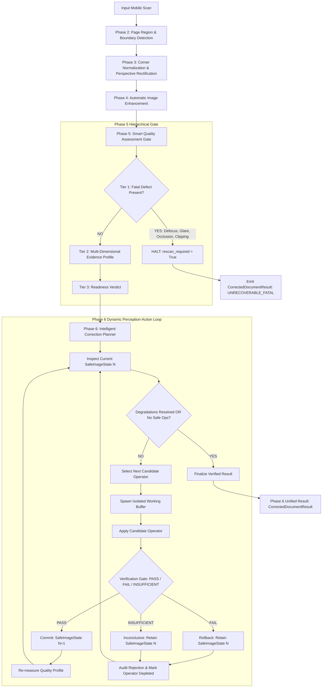
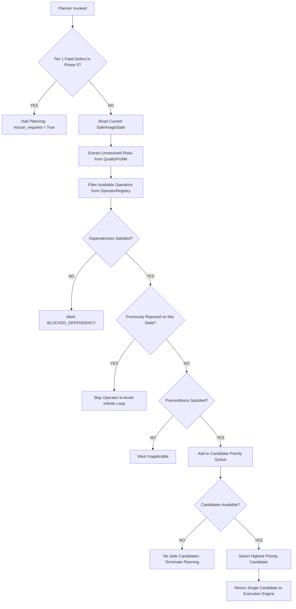
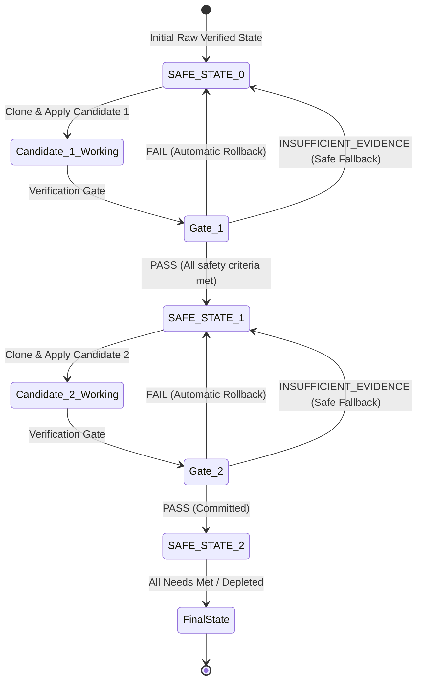
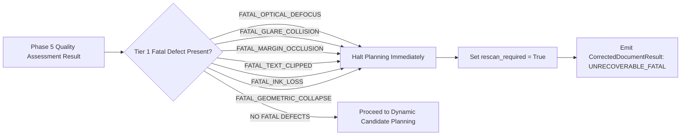
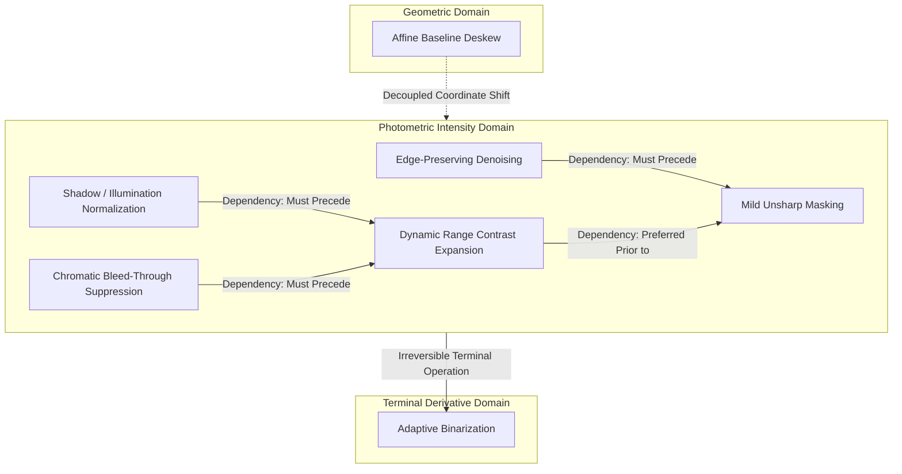

# PHASE 6.2: PRODUCTION CORRECTION ARCHITECTURE SPECIFICATION

**Document Type:** Production Architecture, Interface Contracts & State Machine Specification  
**Project:** AI-EVAL-OpenCV (Automated Exam-Evaluation & Scanning Pipeline)  
**Date:** 2026-10-03  
**Status:** Approved Architectural Blueprint & Formal Interface Contract  
**Contract Definition File:** [`phase6/correction_contracts.py`](file:///c:/Users/bunde/OneDrive/Desktop/EvalAI/AI-EVAL-OpenCV/phase6/correction_contracts.py)  

---

## 1. Executive Summary & Architectural Scope

Phase 6.1 investigated the physical, empirical, and topological behavior of corrective image operations across 8 defect categories, establishing:
1. Blind correction rules (*blur $\to$ sharpen*, *shadow $\to$ divide*, *noise $\to$ denoise*) systematically corrupt clean documents.
2. Operator ordering dynamics are non-linear (*shadow must precede contrast*, *denoise must precede sharpen*, *binarization must remain a terminal derivative*).
3. Certain physical defects (severe defocus, text-colliding glare, physical occlusions) are **physically unrecoverable**, mandating immediate stoppage.
4. Corrective execution must adhere to a strict **Safe-State Reversibility Model**: unverified candidate modifications can never mutate the current verified state.

**Phase 6.2 formalizes this into an extensible, production-ready architecture and interface contract.**

### Strict Phase 6.2 Guardrails & Architectural Invariants
1. **Design & Architecture Only:** Zero image transformation operators or end-to-end execution loops are implemented in this phase.
2. **Zero Modifications to Frozen Code:** Phases 2, 3, 4, and 5 remain completely untouched (`git status --porcelain` is clean across all previous phases).
3. **No Phase 7 Rescan Automation:** Rescan recommendations exist strictly as a data-contract output signal (`rescan_required = True`), never as a physical camera trigger or hardware retry loop.
4. **No Universal Threshold Freezing:** All numerical thresholds (acutance, halo gain, stroke survival, etc.) are encapsulated in configurable dataclasses (`CorrectionVerificationConfig`, `CorrectionPlanningConfig`) as provisional calibration baselines. No magic numbers exist in interfaces or classes.
5. **Raw Image Preservation:** The original `raw_rectified_bgr` buffer is preserved in every state version and exposed alongside the final corrected result.
6. **Geometry Separation:** Phase 3 owns page geometry and perspective rectification. Phase 6 does not duplicate quad detection or perspective transformation.

---

## 2. High-Level System Architecture

The overall document processing and evaluation pipeline coordinates through strictly defined contracts:



---

## 3. Core Architectural Components

### 3.1 `SafeImageState` (Verified State Representation)
The `SafeImageState` is an immutable snapshot representing a state that has **passed all multi-dimensional safety verification checks**.

```python
@dataclass(frozen=True)
class SafeImageState:
    state_id: str                              # e.g., "state_v0_raw", "state_v1_shadow"
    version_index: int                         # Monotonically increasing revision counter (0, 1, 2, ...)
    parent_state_id: Optional[str]             # Direct predecessor in verification DAG
    image_gray: np.ndarray                     # Working verified grayscale buffer
    image_bgr: Optional[np.ndarray]            # Optional color representation
    raw_rectified_bgr: np.ndarray              # Immutable original raw rectified BGR
    applied_operator_id: Optional[str]         # Operator that produced this state (None for v0)
    quality_profile: Optional[QualityEvidenceProfile] # Snapshot of Phase 5 quality profile
    verification_evidence: Optional[CorrectionVerificationEvidence] # Post-correction evidence
    is_verified_safe: bool = True
    created_timestamp: float = field(default_factory=time.time)
```

#### Core Invariants:
1. **Unverified Candidates Banned:** If `is_verified_safe` is `False`, constructor raises `ValueError`. A candidate image that has not passed verification can never be instantiated as a `SafeImageState`.
2. **Provenance Traceability:** Every state maintains a pointer to its `parent_state_id`, forming a tamper-proof revision graph.
3. **Raw Image Immortality:** `raw_rectified_bgr` remains unmodified across all revisions.

---

### 3.2 `CorrectionCandidate` (Operator Metadata & Contract)
A candidate represents a concrete proposal by the planner to execute an operator against the current safe state:

```python
@dataclass
class CorrectionCandidate:
    candidate_id: str                          # Unique candidate ID
    operator_id: str                           # E.g., "SHADOW_NORMALIZATION"
    condition_category: DefectConditionCategory # Defect being addressed
    recoverability_class: RecoverabilityClass  # RECOVERABLE / CONDITIONALLY_RECOVERABLE
    dependencies: List[str]                    # Prerequisites that must be satisfied
    prerequisites: Dict[str, Any]              # Precondition boundaries
    expected_benefit: str                      # Stated goal
    risk_category: str                         # E.g., "HALO_RINGING", "STROKE_LOSS"
    is_reversible: bool = True
    is_verification_mandatory: bool = True
    priority: int = 100                        # Dynamic scheduling priority
    config_parameters: Dict[str, Any]          # Parameter bundle passed to operator
```

---

### 3.3 `IntelligentCorrectionPlanner` (Dynamic Non-Linear Deliberation)
The planner is **dynamic**, not a static linear pipeline. A static pipeline (*always run Shadow $\to$ Denoise $\to$ Contrast $\to$ Sharpen*) is strictly rejected because it damages clean documents and ignores non-linear interactions.

#### Planner Responsibilities:
1. **Fatal Gate Interception:** If Phase 5 reports any Tier 1 fatal defect, planning immediately halts; returns `None` and flags `rescan_required = True`.
2. **Condition Identification:** Extracts remaining degradable risks from the current `SafeImageState` quality snapshot.
3. **Dependency Filtering:** Resolves operator dependencies (e.g., if both shadow and low-contrast exist, blocks contrast stretching until shadow normalization is committed).
4. **Prior Rejection Awareness:** Never reschedules an operator that was previously rejected for the same condition on the current state branch.
5. **Single-Candidate Selection:** Selects the highest-priority applicable candidate for immediate execution.
6. **Dynamic Re-Evaluation:** After every commit or rollback, re-measures document condition from the active safe state before deliberating the next step.



---

### 3.4 `CorrectionExecutionEngine` (Atomic Execution & Isolation)
The execution engine enforces absolute physical isolation between working buffers and verified states:

```python
class CorrectionExecutionEngine(ABC):
    @abstractmethod
    def execute_and_verify(
        self,
        current_state: SafeImageState,
        candidate: CorrectionCandidate,
        operator: CorrectionOperator,
        verifier: CorrectionVerificationGate,
        config: CorrectionVerificationConfig
    ) -> Tuple[SafeImageState, Union[AppliedCorrectionRecord, RejectedCorrectionRecord]]:
        raise NotImplementedError
```

#### Execution Protocol:
1. **Clone:** Spawns an isolated memory copy of `current_state.image_gray`. The `current_state` object is frozen/immutable.
2. **Transform:** Invokes `operator.apply(isolated_buffer, candidate.config_parameters)`.
3. **Verify:** Dispatches `(current_state, isolated_buffer, candidate)` to the `CorrectionVerificationGate`.
4. **State Transition:**
   - **On `PASS`:** Constructs and returns `(SafeImageState N+1, AppliedCorrectionRecord)`.
   - **On `FAIL`:** Discards `isolated_buffer`, logs `RejectedCorrectionRecord` with rejection reasons, and returns `(current_state N, RejectedCorrectionRecord)`.
   - **On `INSUFFICIENT_EVIDENCE`:** Treats as inconclusive; retains `current_state N` to avoid unverified corruption.

---

### 3.5 `CorrectionVerificationGate` (Multi-Dimensional Evidence Gate)
Verification evaluates whether an operation improved the target condition **without collateral damage** across orthogonal physical dimensions:

| Evidence Dimension | Measurement Metric | Safe Threshold (Provisional) | Failure Consequence |
| :--- | :--- | :--- | :--- |
| **Thin-Stroke Preservation** | Ratio of surviving 1-pixel skeleton stroke pixels | `thin_stroke_survival >= 0.80` | `FAIL_STROKE_LOSS` $\to$ Instant Rollback |
| **Faint-Stroke Retention** | Fractional loss of low-contrast stroke pixels | `faint_stroke_loss < 0.15` | `FAIL_FAINT_STROKE_ERASURE` $\to$ Instant Rollback |
| **Halo & Edge Ringing** | Gradient overshoot in stroke perimeter bands | `halo_overshoot_gain < 10.0` | `FAIL_HALO_OVERSHOOT` $\to$ Instant Rollback |
| **Substrate Noise Change** | Standard deviation delta on flat paper substrate | `substrate_noise_delta < 3.0` | `FAIL_NOISE_EXPLOSION` $\to$ Instant Rollback |
| **Topological Integrity** | Connected component count ratio ($CC_{\text{post}} / CC_{\text{pre}}$) | $|CC_{\text{ratio}} - 1.0| \le 0.20$ | `FAIL_TOPOLOGY_FRAGMENTATION` $\to$ Rollback |
| **Background Consistency** | Mean intensity drift of flat paper | `abs(bg_drift) <= 15.0` | `FAIL_BACKGROUND_INSTABILITY` $\to$ Rollback |
| **Remediation Efficacy** | Metric of defect being treated ($\Delta_{\text{stroke}}$ or acutance) | Positive improvement | `NO_OP_PREFERABLE` $\to$ Revert if zero gain |

---

## 4. Rollback State Transition Model

The state transition graph below demonstrates the atomic reversibility model:



### Architectural Policy for `INSUFFICIENT_EVIDENCE`
When post-correction measurements cannot conclusively determine whether an image improved or degraded (e.g. text region too sparse for skeleton analysis, or illumination variance statistically noisy):
- **Rule:** The candidate image is **REJECTED** and the pipeline retains the previous verified safe state.
- **Rationale:** In academic document evaluation, preserving genuine verified evidence strictly supersedes speculative enhancement.

---

## 5. Fatal Defect Interception Model

Phase 5 Tier 1 fatal defects represent irreversible physical information loss. The correction planner intercepts these defects before any computation:



### Mandate on Prohibited Interventions:
1. **Severe Defocus Blur:** Unsharp masking or deconvolution cannot reconstruct high-frequency text signals that were never captured. Sharpening defocused blobs merely forms false loops and ringing artifacts.
2. **Text-Colliding Specular Glare:** Sensor saturation ($255, 255, 255$) has zero dynamic range. Inpainting over saturated text constitutes algorithmic forgery.
3. **Physical Occlusion:** Text occluded by student hands or clipboards does not exist in the captured photons. Algorithmic handwriting hallucination is prohibited.

---

## 6. Defect Recoverability Model

Defects are mapped to three architectural classes that dictate planning behavior:

```
                                  ARCHITECTURAL RECOVERABILITY TAXONOMY
                                                    │
        ┌───────────────────────────────────────────┼───────────────────────────────────────────┐
        ▼                                           ▼                                           ▼
   RECOVERABLE                          CONDITIONALLY RECOVERABLE                         UNRECOVERABLE
• Regional Cast Shadows                  • Low Dynamic Range Contrast                 • Severe Optical Defocus
• Substrate Sensor Noise                 • Mild Optical Softness                      • Text-Colliding Glare
• Residual Baseline Skew                 • Verso Bleed-Through                        • Foreign Object Occlusion
• Margin Specular Glare                  • Faint Pencil Strokes                       • Boundary Text Clipping
                                                                                      • Catastrophic Geometric Collapse
```

1. **`RECOVERABLE`:** Operators addressing these defects are scheduled with standard verification checks. Expected success rate is high without risk of information loss.
2. **`CONDITIONALLY_RECOVERABLE`:** Operators carry intrinsic information-loss risks (e.g., contrast stretching clipping faint pencil; sharpening amplifying noise). The planner enforces strict verification gates (`thin_stroke_survival >= 0.80`, `faint_stroke_loss < 0.15`).
3. **`UNRECOVERABLE`:** Operators targeting these defects are permanently banned. Planning immediately terminates with `rescan_required = True`.

---

## 7. Operator Dependency & Interaction Model

Dynamic candidate selection is constrained by physical inter-operator dependencies:



### Dependency Rules:
1. **`SHADOW_NORMALIZATION` $\prec$ `CONTRAST_EXPANSION`:** Background paper must be leveled before stretching contrast. Stretching an uneven illumination field permanently clips shadowed ink to black.
2. **`DENOISING` $\prec$ `SHARPENING`:** Paper grain must be smoothed before edge enhancement; otherwise, sharpening amplifies grain into persistent edge specks.
3. **`BLEED_THROUGH_SUPPRESSION` $\prec$ `CONTRAST_EXPANSION`:** Verso ink bleed must be removed while chromatic separation exists; stretching darkens brown bleed into black strokes.
4. **`GEOMETRIC_DESKEW` decoupled from Photometric Operations:** Affine coordinate rotation operates strictly on spatial coordinates and must not alter pixel intensity distributions.
5. **`BINARIZATION` as Terminal Derivative:** 1-bit binarization destroys all grayscale gradients and paper substrate context. It is strictly forbidden as an intermediate state.

---

## 8. Operator Registry Architecture

Future image processing operators are integrated via the `CorrectionOperator` interface without modifying the planner or execution engine:

```python
class CorrectionOperator(ABC):
    @property
    @abstractmethod
    def operator_id(self) -> str:
        """Unique operator identifier."""
        raise NotImplementedError

    @property
    @abstractmethod
    def supported_condition(self) -> DefectConditionCategory:
        """Target condition."""
        raise NotImplementedError

    @property
    @abstractmethod
    def recoverability_class(self) -> RecoverabilityClass:
        """Default recoverability."""
        raise NotImplementedError

    @property
    @abstractmethod
    def prerequisite_operators(self) -> List[str]:
        """Operator prerequisites."""
        raise NotImplementedError

    @abstractmethod
    def estimate_applicability(
        self,
        current_state: SafeImageState,
        quality_profile: QualityEvidenceProfile
    ) -> Tuple[bool, str]:
        """Assess whether operator should run."""
        raise NotImplementedError

    @abstractmethod
    def apply(
        self,
        candidate_image: np.ndarray,
        config: Dict[str, Any]
    ) -> np.ndarray:
        """Execute transformation on isolated copy."""
        raise NotImplementedError
```

Operators to be registered in subsequent phases include:
- `MorphologicalBackgroundDivisionOperator`
- `BilateralSubstrateFilterOperator`
- `PercentileContrastStretchOperator`
- `MildUnsharpMaskOperator`
- `ChromaticBleedThroughSuppressionOperator`
- `AffineCoordinateDeskewOperator`

---

## 9. Final Output Contract (`CorrectedDocumentResult`)

The downstream evaluation engine (OCR, HTR, OMR, AI rubrics) receives a unified, immutable contract:

```python
@dataclass
class CorrectedDocumentResult:
    status: str                                # "CORRECTED_VERIFIED", "PRISTINE_PASS_THROUGH", "PARTIAL_SAFE_FALLBACK", "UNRECOVERABLE_FATAL"
    final_safe_state: SafeImageState          # The committed terminal safe state
    corrected_gray: np.ndarray                 # Primary enhanced grayscale buffer for OCR/HTR
    preserved_raw_bgr: np.ndarray              # Original unmodified rectified BGR
    binary_derivative: Optional[np.ndarray]    # Optional binary derivative for OMR
    applied_corrections: List[AppliedCorrectionRecord] # Immutable audit of accepted ops
    rejected_corrections: List[RejectedCorrectionRecord] # Immutable audit of rejected ops
    rollback_events: List[RollbackEventRecord] # Audit of rollback occurrences
    audit_trail: List[CorrectionAuditEntry]    # Step-by-step chronological log
    rescan_required: bool                      # Flagged True if fatal defects exist
    human_review_required: bool                # Flagged True if borderline quality remains
    overall_recoverability: RecoverabilityClass# Final recoverability status
    quality_assessment_initial: QualityAssessmentResult # Phase 5 assessment before correction
    quality_assessment_final: Optional[QualityAssessmentResult] # Phase 5 assessment after correction
    total_processing_latency_ms: float
    metadata: Dict[str, Any] = field(default_factory=dict)
```

---

## 10. Configuration & Threshold Management Strategy

To ensure zero magic numbers exist across the architecture, all operational parameters are organized into centralized configuration dataclasses:

1. **`CorrectionVerificationConfig`:**
   - Controls verification tolerances: `min_thin_stroke_survival` (0.80), `max_faint_stroke_loss` (0.15), `max_halo_gain` (10.0), `max_substrate_noise_gain` (3.0), etc.
   - All parameters represent provisional calibration baselines that can be tuned during Phase 11 field testing without modifying architectural code.
2. **`CorrectionPlanningConfig`:**
   - Controls iteration caps (`max_planner_iterations = 5`), condition deficit trigger thresholds, and dependency resolution behavior.
3. **`QualityGateConfig` (from Phase 5):**
   - Supplies the baseline thresholds for Tier 1 fatal defect gates.

---

## 11. Architectural Compliance & Boundary Audit

Before concluding Phase 6.2, we audit strict adherence to all stated mandates:

| Requirement / Mandate | Compliance Status | Architectural Proof |
| :--- | :---: | :--- |
| **Phase 2–5 Unmodified** | **VERIFIED** | `git status --porcelain` confirms 0 modifications in `phase2/`, `phase3/`, `phase4/`, `phase5/`. |
| **No Phase 7 Automation** | **VERIFIED** | Zero hardware/camera triggers or retry loops. `rescan_required` is solely a data signal. |
| **No Image Execution** | **VERIFIED** | `phase6/correction_contracts.py` contains only dataclasses, enums, ABCs, and protocols. |
| **No Universal Fixed Order** | **VERIFIED** | Planner is non-linear and dynamic; selects next candidate based on current measured state. |
| **No Universal Thresholds** | **VERIFIED** | All parameters reside in `CorrectionVerificationConfig` and `CorrectionPlanningConfig`. |
| **Raw BGR Preservation** | **VERIFIED** | `raw_rectified_bgr` is an immutable field in `SafeImageState` and `CorrectedDocumentResult`. |
| **Safe-State Reversibility** | **VERIFIED** | Candidates execute on isolated clones; unverified states cannot become `SafeImageState`. |
| **Fatal Defect Handling** | **VERIFIED** | Tier 1 defects trigger immediate halt with `rescan_required = True`. |
| **Geometry Decoupling** | **VERIFIED** | Phase 3 owns page geometry. Phase 6 does not duplicate quad detection or perspective warp. |
