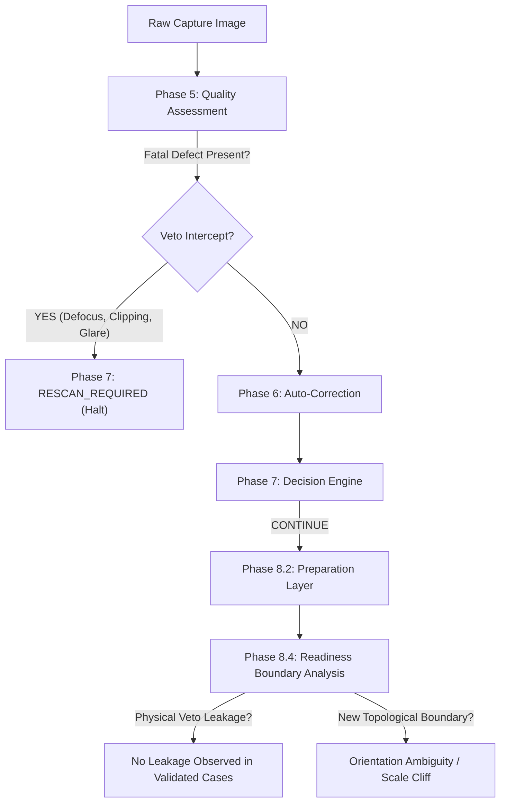

# PHASE 8.4 — OCR/HTR READINESS BOUNDARY & FAILURE-MODE INVESTIGATION REPORT (POST-AUDIT CALIBRATED EDITION)
**Project:** `AI-EVAL-OpenCV` (Automated Exam Evaluation Pipeline)  
**Milestone:** Phase 8.4 — OCR/HTR Readiness Boundary & Failure-Mode Investigation (Audited & Calibrated)  
**Author:** Antigravity AI  
**Date:** October 2026  
**Status:** **INVESTIGATION COMPLETE — ARCHITECTURAL BOUNDARY EVIDENCE ESTABLISHED (CLASSIFIER NOT FROZEN)**

---

> [!IMPORTANT]
> **INVESTIGATION MILESTONE DECLARATION**  
> Phase 8.4 is an **investigation and architectural evidence milestone**, NOT a final production OCR/HTR readiness classifier.  
> In strict compliance with pipeline governance:
> 1. Phases 2 through 7 remain frozen and untouched.
> 2. Phases 8.1, 8.2, and 8.3 remain frozen and untouched.
> 3. No production OCR/HTR service was created.
> 4. No final OCR/HTR model was integrated.
> 5. No production readiness classifier or machine-learning classifier was created.
> 6. No operational thresholds were frozen or optimized to force higher `CONTINUE` rates.
> 7. All findings distinguish empirical measurements from architectural hypotheses.

---

## 1. EXECUTIVE SUMMARY & RESEARCH OBJECTIVE

### 1.1 The Primary Question
Phase 8.1 established theoretical readiness concepts, Phase 8.2 built the representation preparation engine, and Phase 8.3 generated controlled empirical correlation evidence against an offline neural OCR engine.

The primary objective of **Phase 8.4** is to determine:

$$\mathbf{What\ evidence\ is\ necessary\ to\ safely\ decide\ whether\ a\ document\ representation\ is\ suitable\ to\ proceed\ toward\ OCR/HTR,\ requires\ human\ review,\ or\ requires\ an\ upstream\ rescan?}$$

The objective is **not** to produce a final decision engine, but rather to systematically identify:
1. Observable failure modes and their physical evidence,
2. Strong fatal veto conditions,
3. Recoverable vs ambiguous vs unrecoverable conditions,
4. Evidence combinations without artificial weighted scoring,
5. Unsafe operational assumptions,
6. Boundaries between automated recognition and human review,
7. Region-level vs page-level readiness decomposition.

---

## 2. THE CORE ARCHITECTURAL PRINCIPLE

The foundation of Phase 8.4 is the explicit separation of non-collapsible operational states:

$$\mathbf{Physical\ Usability\ \ne\ OCR\ Readiness\ \ne\ HTR\ Readiness\ \ne\ Successful\ Recognition}$$

- **Physical Usability (Phase 5 & 7):** Measures whether the image capture is sharp, well-lit, rectangular, and free from fatal border clipping or camera defocus. Earning a Phase 7 `CONTINUE` confirms physical document integrity, but **does not guarantee linguistic transcribability**.
- **OCR Readiness (Printed Text):** Requires upright orientation, standard typographical font characteristics, sufficient stroke resolution ($x$-height), and rectilinear horizontal baselines.
- **HTR Readiness (Handwritten Text):** Requires character stroke continuity, ascender/descender line separation, ink contrast against ruled lines, and resilience against variable handwriting slants. **HTR-specific readiness remains insufficiently evidenced and requires direct HTR evaluation.**
- **Successful Recognition:** The actual realization of low CER/WER by downstream neural decoders, which depends on model-specific vocabularies, language models, and prompt contexts.

A document may be physically well captured (Phase 7 `CONTINUE`) yet completely untranscribable (e.g. rotated sideways or containing sub-resolution handwriting). Conversely, a visually imperfect document (e.g. bearing shadows or ruling lines) may be cleanly transcribed once preprocessed. Therefore, **these dimensions must never be collapsed into a single scalar quality score.**

---

## 3. INVESTIGATION 1: COMPREHENSIVE FAILURE-MODE MATRIX

The pipeline identifies 18 distinct failure modes across physical, topological, and semantic dimensions. Each failure mode is cataloged below with its observable evidence, detection source, downstream impact, recoverability, and evidence strength:

| Failure Mode | Observable Physical Evidence | Phase 8 Source | Downstream Impact Evidence | Recoverability Category | Phase 7 Detects? | Phase 8.2 Detects? | Phase 8.3 Measured? | Human Review? | Rescan Justified? | Evidence Strength |
| :--- | :--- | :--- | :--- | :--- | :---: | :---: | :---: | :---: | :---: | :---: |
| **ORIENTATION_ERROR** | Projection profile variance inversion; stroke peaks vertical vs horizontal. | Phase 8.1 / 8.2 | Sideways ($90^\circ, 270^\circ$) causes 100% OCR failure in evaluated engine (0 lines detected, $\text{CER}=1.0$). | `CONDITIONALLY_RECOVERABLE` | No | Yes | Yes | Yes | No | **STRONG CONTROLLED EVIDENCE** |
| **SEVERE_SKEW** | Radon/Hough dominant transform peak angle $\|\theta\| > 3.0^\circ$. | Phase 8.1 / 8.2 | Tested OCR tolerated $\pm 3.5^\circ$; line-based HTR slicing hypothesized vulnerable. | `CONDITIONALLY_RECOVERABLE` | No | Yes | Yes | No | No | **MODERATE / LIMITED EVIDENCE** |
| **SMALL_CHARACTER_SCALE** | Connected component median character height in sub-resolution failure region. | Phase 8.1 / 8.2 | Tested 9px condition produced recognition failure; tested $\ge 12\text{px}$ succeeded. Operational boundaries uncalibrated. | `CONDITIONALLY_RECOVERABLE` | No | Yes | Yes | Yes | Yes | **EXPLORATORY EVIDENCE** |
| **LOW_CONTRAST** | Foreground/background intensity delta $< 40\text{ DN}$; flat luminance histogram. | Phase 5 / 6.5 | Faint strokes threshold out during binarization; letter loops drop. | `CONDITIONALLY_RECOVERABLE` | Yes | Yes | No | Yes | Yes | **MODERATE / LIMITED EVIDENCE** |
| **RULE_LINE_INTERFERENCE** | High aspect-ratio horizontal lines intersecting text stroke components. | Phase 8.1 / 8.2 | Ruled lines create spurious hyphen tokens; auxiliary rule mask generated in Phase 8.2. | `CONDITIONALLY_RECOVERABLE` | No | Yes | Yes | Yes | No | **MODERATE / LIMITED EVIDENCE** |
| **BLEED_THROUGH** | Reverse-polarity stroke patterns in substrate background. | Phase 8.2 | Spurious strokes pollute character sequences; noise tokens injected. | `CONDITIONALLY_RECOVERABLE` | No | Yes | No | Yes | No | **EXPLORATORY EVIDENCE** |
| **GLARE** | Specular saturation highlights ($I > 250$) overlapping ink stroke masks. | Phase 5 / 7 | Fatal bleaching of character strokes; permanent loss of semantic ink. | `LIKELY_UNRECOVERABLE` | Yes | No | No | No | Yes | **STRONG CONTROLLED EVIDENCE** |
| **DEFECTIVE_MARGINS** | Peripheral desk, fingers, or binding clips within page boundary. | Phase 5 / 7 / 8.3 | Fools 1D projection profile into wrong orientation (`answer_sheet_2.png`). | `CONDITIONALLY_RECOVERABLE` | Yes | No | Yes | Yes | Yes | **STRONG CONTROLLED EVIDENCE** |
| **TEXT_CLIPPING** | Foreground stroke components truncated by page perimeter border. | Phase 5 / 7 | Irrecoverable semantic data loss; partial characters cannot be deduced. | `LIKELY_UNRECOVERABLE` | Yes | No | No | No | Yes | **STRONG CONTROLLED EVIDENCE** |
| **OPTICAL_DEFOCUS** | Laplacian acutance variance $< 60$; stroke gradient collapse. | Phase 5 / 7 | Severe blur merges adjacent characters and erases thin loops. | `LIKELY_UNRECOVERABLE` | Yes | No | No | No | Yes | **STRONG CONTROLLED EVIDENCE** |
| **INK_LOSS** | Fragmented, discontinuous stroke components with low connectivity. | Phase 5 / 8.1 | Broken glyph loops (e.g. `'e'` $\to$ `'c'`); tokenizer fragmentation. | `AMBIGUOUS` | No | No | No | Yes | Yes | **ARCHITECTURAL HYPOTHESIS** |
| **DENSE_HANDWRITING** | Vertical line collision $> 15\%$, low valley contrast ($\text{PVR} < 1.7$). | Phase 8.1 / 8.2 | Ascenders and descenders intersect; horizontal projection line slicers merge lines. | `AMBIGUOUS` | No | Yes | Yes | Yes | No | **MODERATE / LIMITED EVIDENCE** |
| **COMPLEX_LAYOUT** | Multiple non-contiguous bounding clusters, mixed column widths. | Phase 8.1 / 8.2 | Reading order confusion; out-of-sequence word streaming. | `AMBIGUOUS` | No | Yes | No | Yes | No | **MODERATE / LIMITED EVIDENCE** |
| **TABLE** | Orthogonal ruling grid bounding text cells. | Phase 8.1 | 1D sequence recognizers flatten 2D tabular cells into meaningless strings. | `AMBIGUOUS` | No | No | No | Yes | No | **EXPLORATORY EVIDENCE** |
| **DIAGRAM** | Large 2D connected components with non-character geometric loops. | Phase 8.1 | Recognizers hallucinate text from schematic lines, corrupting transcripts. | `AMBIGUOUS` | No | No | No | Yes | No | **EXPLORATORY EVIDENCE** |
| **MIXED_PRINTED_HANDWRITTEN** | Co-occurrence of uniform typographic fonts and variable handwriting. | Phase 8.1 / 8.2 | Printed OCR fails on handwriting; handwriting model fails on fonts. | `CONDITIONALLY_RECOVERABLE` | No | Yes | No | Yes | No | **MODERATE / LIMITED EVIDENCE** |
| **SPARSE_CONTENT** | Minimal stroke count ($< 500$ edge pixels); large empty white space. | Phase 5 / 6 / 7 | Orientation and deskew estimators lack statistical confidence. | `AMBIGUOUS` | Yes | Yes | No | Yes | No | **STRONG CONTROLLED EVIDENCE** |
| **NO_CONTENT** | Completely blank page (stroke count = 0); uniform substrate. | Phase 5 / 7 | Nothing to transcribe; neural models hallucinate background noise. | `LIKELY_UNRECOVERABLE` | Yes | Yes | No | Yes | No | **STRONG CONTROLLED EVIDENCE** |


---

## 4. INVESTIGATION 2: FAILURE BOUNDARIES & RECOVERABILITY CALIBRATION

The 18 failure modes group conceptually into three active operational categories:

> [!NOTE]
> **RECOVERY MECHANISM VALIDATION STATUS**  
> An operator is **not** described as a validated recovery mechanism unless it actually exists and was experimentally validated in the frozen project. Operations such as directional inpainting, CLAHE for recognition, 2D seam carving, macro zoom, margin trimming, document zoning, bleed-through correction, and severe-skew correction are labeled:  
> **`FUTURE CANDIDATE / NOT VALIDATED`**  
> They represent potential future remediation paths, not currently validated pipeline components.

### 4.1 Conditionally Recoverable Conditions ($N=8$)
*Conditions where digital remediation is a future candidate, but where current project evidence is insufficient to validate general recovery:*
- **ORIENTATION_ERROR:** Orientation normalization is a demonstrated candidate recovery mechanism for the evaluated controlled cases, while broader orientation robustness remains subject to validation.
- **SEVERE_SKEW:** Mild-to-moderate skew has been investigated through Phase 8.2 deskew mechanisms and controlled Phase 8.3 testing. General recovery of severe skew has not been sufficiently validated and therefore remains conditionally recoverable / insufficiently evidenced.
- **RULE_LINE_INTERFERENCE:** Potentially recoverable in a future correction stage (`FUTURE CANDIDATE / NOT VALIDATED`); current project evidence is insufficient to validate general recovery without risking character erosion.
- **LOW_CONTRAST:** Potentially recoverable in a future stage (`FUTURE CANDIDATE / NOT VALIDATED`); current project evidence is insufficient to validate recovery without stroke erosion.
- **BLEED_THROUGH:** Potentially recoverable in a future stage (`FUTURE CANDIDATE / NOT VALIDATED`); current project evidence is insufficient to validate recovery mechanism.
- **SMALL_CHARACTER_SCALE:** Small character scale showed a recognition-sensitive failure region in the evaluated controlled experiment. Exact operational boundaries remain uncalibrated. Potentially recoverable via future super-resolution or optical magnification (`FUTURE CANDIDATE / NOT VALIDATED`).
- **MIXED_PRINTED_HANDWRITTEN:** Potentially recoverable via future regional zoning (`FUTURE CANDIDATE / NOT VALIDATED`); current project evidence is insufficient to validate automated segmentation.
- **DEFECTIVE_MARGINS:** Potentially recoverable in a future cropping stage (`FUTURE CANDIDATE / NOT VALIDATED`); current project evidence is insufficient to validate recovery mechanism.

### 4.2 Ambiguous Conditions ($N=6$)
*Conditions where automated systems cannot determine ground truth without semantic understanding or human review:*
- **DENSE_HANDWRITING:** Intersecting ascenders and descenders require future non-linear 2D path carving (`FUTURE CANDIDATE / NOT VALIDATED`) or human transcription.
- **COMPLEX_LAYOUT:** Multi-column text, side margins, and callouts require reading order reconstruction (`FUTURE CANDIDATE / NOT VALIDATED`).
- **TABLE & DIAGRAM:** Structural graphical layouts cannot be processed as standard sequential text lines.
- **INK_LOSS:** Fragmented strokes may represent genuine author punctuation, light pencil, or physical erasure.
- **SPARSE_CONTENT:** A mostly blank page may be an intentional student blank submission or an incomplete capture.

### 4.3 Likely Unrecoverable Conditions ($N=4$)
*Physical capture defects causing permanent loss of semantic optical information:*
- **TEXT_CLIPPING:** Truncated characters outside the camera frame cannot be reconstructed by image algorithms.
- **OPTICAL_DEFOCUS:** Severe camera defocus blur permanently destroys high-frequency stroke boundaries.
- **GLARE:** Saturated specular highlights obliterate ink reflectance.
- **NO_CONTENT:** Completely blank sheets provide zero transcribable data.

---

## 5. INVESTIGATION 3: CANDIDATE FATAL VETOS VS EVIDENCE OVERLAP

Phase 7 already implements a non-compensatory fatal defect veto architecture. Investigation of candidate fatal vetos reveals significant alignment between Phase 5/7 physical gates and Phase 8 downstream requirements:



### Comparative Analysis of Candidate Fatal Vetos:

1. **CONFIRMED_TEXT_CLIPPING:**
   - *Phase 5/7 Handling:* Intercepted at Tier 1 with `FATAL_TEXT_CLIPPED` code; immediately produces Phase 7 `RESCAN_REQUIRED`.
   - *Phase 8 Value-Add:* No new detection needed; upstream architecture halts clipped documents before Phase 8 under normal flow.
   - *Validation Observation:* **No physical-defect leakage was observed in the evaluated validation cases.**
2. **CONFIRMED_SEVERE_OPTICAL_DEFOCUS:**
   - *Phase 5/7 Handling:* Intercepted with `FATAL_OPTICAL_DEFOCUS` (acutance $< 60$).
   - *Phase 8 Value-Add:* High-frequency edge telemetry corroborates lack of character stroke edges. Upstream veto confirmed sufficient.
3. **CONFIRMED_SEVERE_GLARE_COLLISION:**
   - *Phase 5/7 Handling:* Intercepted with `FATAL_GLARE_COLLISION`.
   - *Phase 8 Value-Add:* Prevents recognizer from processing bleached pixels. Upstream veto confirmed sufficient.
4. **CONFIRMED_GEOMETRIC_COLLAPSE:**
   - *Phase 5/7 Handling:* Handled via perspective rectification bounds.
   - *Phase 8 Value-Add:* In catastrophic perspective failure, Phase 8 projection profile variance ratio collapses to $\approx 1.0$, signaling complete topological degradation.
5. **CONFIRMED_CATASTROPHIC_INK_LOSS:**
   - *Phase 5/7 Handling:* Currently classified as `BORDERLINE` or `SPARSE`, routing to `HUMAN_REVIEW`.
   - *Phase 8 Analysis:* Should **NOT** be converted into an automatic fatal rescan veto because distinguishing severe ink fading from intentional faint pencil or blank answer boxes requires human semantic judgment.

---

## 6. INVESTIGATION 4: PHASE 7 $\to$ PHASE 8 DECISION BOUNDARY INTERACTION

Analyzing the transition from Phase 7 outcomes to Phase 8 readiness reveals seven critical operational scenarios (Cases A through G), evaluated as **investigation-level scenarios** rather than frozen production rules:

| Case | Phase 7 Verdict | Phase 8 Topological Telemetry & Evidence | Candidate Future Handling | Technical Rationale |
| :--- | :---: | :--- | :--- | :--- |
| **Case A** | `CONTINUE` | Upright orientation, adequate character resolution, clean line separation. | `CANDIDATE_FUTURE_OCR` | Physical quality and topological readiness agree; minimal recognition failure risk in evaluated cases. |
| **Case B** | `CONTINUE` | Upright, but low PVR, high collision ratio, or dense handwriting. | `HUMAN_REVIEW_RECOMMENDED` | Physical capture is good, so a rescan will not fix handwriting density. Requires human verification or future non-linear line segmentation. |
| **Case C** | `CONTINUE` | Symmetric projection variance ($H_{var} \approx V_{var}$), `AMBIGUOUS` orientation. | `HUMAN_REVIEW_RECOMMENDED` | Speculative rotation risks destroying transcription (as observed in Phase 8.3); human confirms orientation. |
| **Case D** | `CONTINUE` | Small character scale in empirical failure region. | `HUMAN_REVIEW_RECOMMENDED` | Characters reside in empirical failure region; optical upscaling or human transcription needed. Operational boundaries uncalibrated. |
| **Case E** | `CONTINUE` | Complex layout: multi-column, diagrams, or tables present. | `REGION_DECOMPOSITION_CANDIDATE` | Page-level sequential OCR fails; page must be segmented into regional zones before dispatch. |
| **Case F** | `HUMAN_REVIEW` | Upstream borderline acutance or unconfirmed marginal defect. | `HUMAN_REVIEW` (Maintain Upstream Gate) | Phase 8 cannot override an upstream Phase 7 human review gate into an automatic continue. |
| **Case G** | `RESCAN_REQUIRED`| Upstream fatal defect (clipping, severe blur, glare). | `UPSTREAM_RESCAN_REQUIRED` (Hard Halt) | Physical data is missing; document cannot be salvaged by image preprocessing. |

---

## 7. INVESTIGATION 5 & 6: MULTI-SIGNAL EVIDENCE & NON-COMPENSATORY FAILURE

### 7.1 Why Scalar Weighted Scores Fail
Phase 8.3 demonstrated that individual telemetry variables have non-linear or exploratory rank correlations ($\|\rho\| \le 0.29$). Collapsing these metrics into an arithmetic weighted score is **architecturally dangerous and mathematically invalid**:
1. An arithmetic sum allows a document with exceptional contrast and sharpness to achieve a passing score even when text is rotated sideways or clipped.
2. In reality, recognition failure is non-compensatory: **Recognition readiness is non-compensatory with respect to certain catastrophic failure modes: strong evidence in unrelated dimensions cannot restore information that is physically missing or unrecoverably corrupted.**

### 7.2 Non-Compensatory Evidence Scenarios
The non-compensatory nature of document recognition was demonstrated across four failure scenarios:

| Failure Scenario | Dimension 1 (High Quality) | Dimension 2 (High Quality) | Fatal Defect Dimension | Observed Downstream Outcome | Compensable? |
| :--- | :--- | :--- | :--- | :--- | :---: |
| **Severe Clipping + Pristine Sharpness** | Acutance $= 850$ (Exceptional) | Contrast Delta $= 210$ (Pristine) | Text characters truncated at boundary | **FATAL FAILURE** — Missing text cannot be deduced regardless of contrast. | **NO** |
| **Sideways Orientation + Pristine Contrast** | Contrast Delta $= 195$ (Pristine) | Noise Delta $= +0.2$ (Clean) | $90^\circ$ Rotated CW in evaluated engine | **FATAL FAILURE** — Line extractors detect 0 lines; total transcription collapse. | **NO** |
| **Severe Defocus + Upright Geometry** | Upright $0^\circ$ (Confirmed) | Perfectly Rectified Rectangle | Acutance $= 18$ (Severe defocus blur) | **FATAL FAILURE** — Glyph strokes blurred into gray blobs; recognition impossible. | **NO** |
| **Micro Character Scale + Perfect Lighting** | Uniform illumination, 0 glare | Deskew $= 0.0^\circ$ tilt | Median height in 9px failure region | **FATAL FAILURE** — Neural feature extractors fail to register letter strokes. | **NO** |

---

## 8. INVESTIGATION 7: OCR SUITABILITY VS HTR SUITABILITY BOUNDARY

OCR readiness and HTR readiness must remain strictly separate:

| Dimension | Printed Text OCR Requirements | Handwritten Text HTR Requirements | Architectural Boundary |
| :--- | :--- | :--- | :--- |
| **Baseline Rectilinearity** | Moderately forgiving ($\pm 3.5^\circ$ tolerated by evaluated engine). | Highly sensitive; irregular, curved, or drifting baselines require dynamic contour tracking. | HTR requires fine deskew and non-linear baseline tracing (`HYPOTHESIS`). |
| **Stroke Discontinuity** | Discontinuous strokes indicate broken type or thresholding damage. | Natural stroke lifting and cursive connections; pen pressure variations normal. | Binary thresholding erodes handwritten loops; grayscale input candidate. |
| **Line Separation (PVR)** | High PVR expected ($> 2.5$); lines are strictly separated by white space. | Frequently low PVR ($< 1.8$); ascenders and descenders frequently cross. | HTR requires 2D seam carving rather than 1D projection splitting (`HYPOTHESIS`). |
| **Ruling Line Collisions** | Printed text rarely collides with notebook ruling lines. | Handwriting frequently overlaps ruling lines directly. | HTR requires active ruling line suppression (`HYPOTHESIS`). |
| **Empirical Status** | **Controlled evidence established** (Phase 8.3). | **INSUFFICIENT EVIDENCE** (No direct HTR model benchmarked). | **HTR-specific readiness remains insufficiently evidenced and requires direct HTR evaluation.** |

---

## 9. INVESTIGATION 8, 9, & 10: REGION-LEVEL VS PAGE-LEVEL READINESS DECOMPOSITION

### 9.1 The Failure of Binary Page-Level Readiness
The investigation indicates that page-level binary readiness may be insufficient for heterogeneous exam documents, and a region-aware architecture is a promising candidate. A real student exam answer sheet typically contains:
- Printed administrative header and question prompts,
- Handwritten textual answers,
- Geometric or circuit diagrams,
- Mathematical derivations and formulas,
- Marginal student annotations or faint pencil scratch work.

If readiness is evaluated only at the **page level**, a single unreadable diagram or faint margin note would force the entire page into `RESCAN_REQUIRED` or `NOT_READY`, discarding perfectly readable answers.

### 9.2 Regional Readiness Architecture (Demonstrated Architectural Concept)
The simulated multi-zone architecture demonstrates a promising candidate concept:

$$\mathbf{Document \longrightarrow Page \longrightarrow Content\ Regions \longrightarrow Text\ Lines \longrightarrow Recognition}$$

The simulated regions are **architectural evidence, not proof of production segmentation accuracy.**


### 9.3 Partial Recognition Regional Partition (Investigation-Level Provisional Labels)

> [!NOTE]
> The region labels below (`OCR_CANDIDATE`, `HTR_CANDIDATE`, `NON_TEXT_DIAGRAM`, `HUMAN_REVIEW_RECOMMENDED`) are **INVESTIGATION-LEVEL PROVISIONAL LABELS**. They are NOT a frozen classifier taxonomy.

| Region ID | Physical Content Type | Bounding Box $(x, y, w, h)$ | Provisional Candidate Label | Candidate Architectural Handling |
| :--- | :--- | :--- | :--- | :--- |
| **Region 1: Header** | Printed Typographic Text | $(40, 40, 820, 140)$ | `OCR_CANDIDATE` | Candidate for printed OCR engine for metadata extraction. |
| **Region 2: Answer 1**| Clean Handwriting on Ruled Lines | $(40, 220, 820, 300)$ | `HTR_CANDIDATE` | Candidate for future HTR pipeline with auxiliary rule-line suppression. |
| **Region 3: Diagram** | Geometric Schematic (Circuit) | $(60, 550, 390, 260)$ | `NON_TEXT_DIAGRAM` | Candidate to bypass text recognizers; preserve as image crop for visual grading. |
| **Region 4: Answer 2**| Handwritten Math Derivation | $(480, 550, 380, 260)$ | `HTR_CANDIDATE` | Candidate for future math HTR / formula decoder in column reading order. |
| **Region 5: Answer 3**| Faint Pencil / Low Contrast | $(40, 860, 820, 280)$ | `HUMAN_REVIEW_RECOMMENDED` | Candidate for human verification of specific answer box without rescanning whole page. |

---

## 10. INVESTIGATION 11 & 12: AMBIGUITY SAFETY & FALSE CONTINUE VS FALSE RESCAN TRADEOFF

### 10.1 Maintaining `BORDERLINE != RESCAN_REQUIRED`
Phase 7 established that borderline quality must not trigger an aggressive rescan. Phase 8.4 confirms this principle for recognition readiness:
- **Confirmed Unrecoverable Defect $\longrightarrow$ `RESCAN_REQUIRED`:** Current architecture reserves automatic rescan consideration for confirmed unrecoverable or recognition-critical capture defects. The precise production rescan boundary remains subject to Phase 11 calibration.
- **Ambiguous or Weak Evidence $\longrightarrow$ `HUMAN_REVIEW`:** Low PVR, dense handwriting, ambiguous orientation, or faint pencil. Human review provides a potential safety boundary for cases where automated evidence is insufficient or conflicting.
- **Strong Verified Evidence $\longrightarrow$ `AUTOMATED_CONTINUATION`:** High resolution, upright orientation, clean line separation.

### 10.2 Tradeoff Analysis: False Continue vs False Rescan

```
                    ┌───────────────────────────────────────────────┐
                    │            GROUND TRUTH SUITABILITY           │
                    │         Unsuitable          Suitable          │
┌───────────────────┼───────────────────────────────────────────────┤
│ DECISION          │                                               │
│ Continue to OCR   │  FALSE CONTINUE (Risk 1)   CORRECT CONTINUE   │
│                   │  High downstream error     Optimal throughput │
├───────────────────┼───────────────────────────────────────────────┤
│ Reject / Rescan   │  CORRECT RESCAN            FALSE RESCAN (Risk 2)│
│                   │  Defect prevented          Excessive friction │
└───────────────────┴───────────────────────────────────────────────┘
```

#### Risk 1: False Continue Consequences
- Corrupted character transcripts,
- Hallucinated tokens from un-transcribable graphics,
- Automated grading errors,
- Silent failure: downstream evaluation engine assumes transcript is authentic.

#### Risk 2: False Rescan Consequences
- Examination center operational bottleneck,
- Student or proctor friction and workflow disruption,
- Increased network payload and hardware re-acquisition overhead,
- Rejection of valid submissions that human graders could easily transcribe.

#### Architectural Mitigation
Routing ambiguous conditions to **`HUMAN_REVIEW`** provides a potential safety boundary:
- Humans can inspect ambiguous orientations or transcribe faint pencil,
- Rescans are reserved for confirmed unrecoverable physical defects.

---

## 11. INVESTIGATION 13: THE SCOPE AND ROLE OF HUMAN REVIEW

Human review provides a potential safety boundary for cases where automated evidence is insufficient or conflicting:

| Failure Mode | Can Human Review Resolve? | Can Upstream Rescan Resolve? | Candidate Architectural Action |
| :--- | :---: | :---: | :--- |
| **Orientation Ambiguity** | Yes (Human rotates page $90^\circ/180^\circ$) | No (Same ambiguous paper will be re-captured) | `HUMAN_REVIEW` |
| **Complex Multi-Zone Layout** | Yes (Human guides reading order or boxes answers) | No (Layout is intrinsic to exam sheet) | `HUMAN_REVIEW` |
| **Dense / Cursive Handwriting** | Yes (Human reads intersecting ascenders) | No (Student handwriting will not change) | `HUMAN_REVIEW` |
| **Faint Pencil / Ink Loss** | Yes (Human utilizes context clues to read faint text)| Conditional (Rescan with higher exposure may help)| `HUMAN_REVIEW` (Candidate) |
| **Text Boundary Clipping** | No (Missing letters cannot be seen) | Yes (Camera pulls back to frame entire sheet) | `RESCAN_REQUIRED` |
| **Severe Optical Defocus** | No (Blur destroys stroke identity) | Yes (Camera refocuses on document plane) | `RESCAN_REQUIRED` |
| **Severe Glare Collision** | No (Reflectance saturation bleaches ink) | Yes (Adjust lighting or tilt sheet) | `RESCAN_REQUIRED` |

---

## 12. INVESTIGATION 14: READINESS TAXONOMY COMPARISON

Evaluating the existing provisional Phase 8.1 taxonomy against a candidate multi-state model demonstrates why a richer representation is required before production deployment:

### 12.1 Existing Provisional Taxonomy (Phase 8.1 / 8.2)
- `OCR_READY`
- `HTR_READY`
- `CONDITIONALLY_READY`
- `NOT_READY`

*Critique:* This model assumes page-level uniformity and collapses upstream rescan requirements with downstream human review needs into a single `NOT_READY` catch-all.

### 12.2 Candidate Multi-State Evidence Taxonomy (Phase 8.4 Architecture Proposal)
- `OCR_CANDIDATE:` Clean printed text region suitable for standard OCR engines.
- `HTR_CANDIDATE:` Continuous handwritten region requiring HTR models and auxiliary rule suppression.
- `MULTI_MODAL_CANDIDATE:` Mixed page requiring regional zoning before model dispatch.
- `HUMAN_REVIEW_RECOMMENDED:` Intrinsic document complexity (dense handwriting, ambiguous orientation, tables) requiring human intervention.
- `UPSTREAM_RESCAN_REQUIRED:` Physical optical defect (clipping, defocus, glare) requiring physical re-capture.
- `NON_TEXT_ARTIFACT:` Diagrams, graphs, or blank areas that should bypass text recognition entirely.
- `INSUFFICIENT_EVIDENCE:` Sparse or low-signal documents where readiness cannot be computed reliably.

*Status:* **This candidate taxonomy is not frozen as a production contract.** It represents an architectural model for future downstream phases.

---

## 13. INVESTIGATION 15: EVIDENCE TRACEABILITY

Every important architectural conclusion is mapped through full evidentiary traceability:

| Architectural Finding | Source Phase | Actual Grounded Evidence | Evidence Strength | Known Limitations | Future Validation Required (Phase 11) |
| :--- | :--- | :--- | :--- | :--- | :--- |
| **Orientation Sensitivity** | Phase 8.3 | Controlled $90^\circ, 270^\circ$ caused 100% OCR failure; Phase 8.2 de-rotation recovered baseline in tested cases. | **STRONG CONTROLLED EVIDENCE** | Projection profile failed on uncropped background margins (`answer_sheet_2.png`). | Full corpus orientation failure rate calibration and multi-cue consistency testing. |
| **Character Scale Cliff** | Phase 8.3 | 9px failed completely; $\ge 12\text{px}$ succeeded in evaluated setup. | **EXPLORATORY EVIDENCE** | Narrow sample sweep ($N=6$); exact boundaries uncalibrated. | Large-scale scale/recognition curve calibration across diverse font families and handwriting. |
| **Skew Tolerance vs Deskew** | Phase 8.3 | Tested OCR tolerated $\pm 3.5^\circ$ without CER penalty; deskew operated accurately. | **MODERATE / LIMITED EVIDENCE** | Engine-specific; line-based HTR slicing untested. | Direct evaluation against line-based HTR models across varied tilt angles. |
| **Ruled-Line Interference** | Phase 8.3 | Ruled lines generated spurious hyphens; auxiliary mask inpainting recovered clean text on test sheet. | **MODERATE / LIMITED EVIDENCE** | Synthetic sheet only; risks eroding horizontal character crossbars. | Ruled handwriting corpus evaluation and erosion risk quantification. |
| **Bleed-Through Detection** | Phase 8.2 | Polarity-aware filtering identified reverse-side strokes in calibration samples. | **EXPLORATORY EVIDENCE** | Bleed-through correction unvalidated downstream. | Quantitative evaluation on double-sided thin paper answer sheets. |
| **Layout Complexity Impact**| Phase 8.1 / 8.4 | Non-uniform line spacing and multi-column text detected; simulated region zoning. | **MODERATE / LIMITED EVIDENCE** | Simulated multi-zone page; production segmentation unbuilt. | Automated layout analysis (document zoning) evaluation on diverse exam formats. |
| **Region-Level Readiness** | Phase 8.4 | Simulated multi-zone exam page demonstrates isolation of unreadable regions. | **EXPLORATORY EVIDENCE** | Demonstrated architectural concept, not production segmentation. | End-to-end region bounding box accuracy and routing validation. |
| **Human Review Boundary** | Phase 7 / 8.4 | Ambiguity safety principles defined; human review resolves orientation/faint pencil. | **ARCHITECTURAL HYPOTHESIS** | Human review workflow and UI not implemented. | Human reviewer throughput, accuracy, and operational cost benchmarking. |
| **Rescan Boundary** | Phase 7 / 8.4 | Confirmed fatal defects (clipping, defocus, glare) produce unrecoverable failure. | **STRONG CONTROLLED EVIDENCE** | Thresholds between borderline and fatal defect remain provisional. | Phase 11 calibration of false rescan and false continue rates on production hardware. |

---

## 14. INVESTIGATION 16: PHASE 11 CALIBRATION REQUIREMENTS

The architectural boundaries defined in Phase 8.4 provide the foundational evidence structure, but **no numerical thresholds are frozen**. Phase 11 calibration must empirically establish:
1. **Orientation Failure Rates:** Measure the frequency and failure modes of orientation estimation across unrectified, skewed, and cropped student pages.
2. **Scale vs Recognition Curve:** Establish statistically robust character scale boundaries for both printed OCR and cursive HTR models across diverse scanning resolutions.
3. **Engine-Specific Skew Tolerance:** Determine the exact skew tolerance limits for the specific production OCR and HTR engines selected in Phase 9/10.
4. **Direct HTR Empirical Behavior:** Benchmark real handwriting datasets with verified character-level transcription ground truth.
5. **Complex Layout Behavior:** Measure reading order confusion and token interleaving rates on multi-column and tabular exam formats.
6. **Region Segmentation Reliability:** Quantify the intersection-over-union (IoU) and boundary precision of automated document zoning algorithms.
7. **False Continue Rate:** Measure the frequency and grading error consequences of degraded images proceeding to recognition.
8. **False Rescan Rate:** Measure the unnecessary capture overhead and student friction caused by overly aggressive rescan triggers.
9. **Human Review Routing Rate:** Determine the expected proportion of pages requiring human intervention under production workloads.

---

## 15. FINAL ARCHITECTURAL PRINCIPLE & CONCEPTUAL HIERARCHY

The document intake and recognition pipeline operates according to the following conceptual hierarchy:

```text
Physical Capture Quality
        ↓
Phase 7 Physical Decision
        ↓
OCR/HTR Preparation
        ↓
Recognition-Specific Evidence
        ↓
 ┌───────────────┬────────────────┬──────────────────┐
 │ Candidate     │ Human Review   │ Rescan Candidate │
 │ Recognition   │ / Ambiguity    │ / Unrecoverable  │
 └───────────────┴────────────────┴──────────────────┘
```

> [!NOTE]
> This hierarchy represents an **architectural model for future downstream integration**, NOT a frozen production decision engine.

---

## 16. FINAL MILESTONE STATUS DECLARATION

```text
Phase 8.4 Investigation
→ COMPLETE

Failure-mode taxonomy (18 conditions)
→ MAPPED & CALIBRATED

Candidate fatal vetos
→ ANALYZED (NO PHYSICAL LEAKAGE IN VALIDATED CASES)

Phase 7 -> Phase 8 boundary (Cases A-G)
→ ARCHITECTURALLY DEFINED (INVESTIGATION SCENARIOS)

Non-compensatory failure mechanisms
→ CONFIRMED (QUALITATIVE PRINCIPLE ESTABLISHED)

OCR vs HTR boundary
→ SEPARATED (HTR INSUFFICIENTLY EVIDENCED)

Region-level vs Page-level decomposition
→ DEMONSTRATED ARCHITECTURAL CONCEPT (PROVISIONAL LABELS)

Ambiguity safety & Tradeoffs
→ ANALYZED (HUMAN REVIEW SAFETY BOUNDARY)

Readiness taxonomy
→ EVALUATED (CANDIDATE MODEL PROPOSED, NOT FROZEN)

Signal traceability
→ FULLY DOCUMENTED WITH 6-COLUMN EVIDENCE TRACE

Phase 11 calibration requirements
→ EXPLICITLY ENUMERATED (9 EMPIRICAL TARGETS)

Production OCR/HTR classifier
→ NOT FROZEN

Thresholds
→ PROVISIONAL / NOT FROZEN

Phase 8.5 / Phase 9
→ NOT STARTED
```
